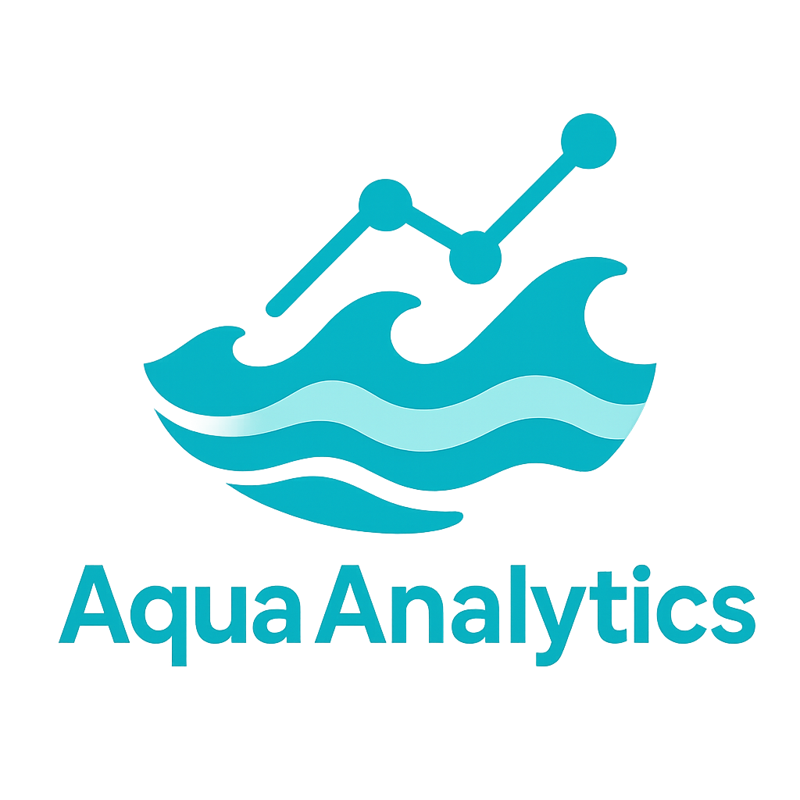

# Aqua Analytics

  

A comprehensive machine learning project for predicting competitive swimming performance across multiple levels of competition. Aqua Analytics applies data science techniques to analyze swimming meet data and forecast various aspects of race outcomes, from individual performance metrics to competitive dynamics.

## Project Overview

Aqua Analytics operates at two distinct competitive levels:

- **National Level**: Prediction models for elite national swimming competitions, focusing on world record residuals, American record differentials, and top seed win probabilities
- **NESCAC Level**: Analysis of Division III conference competition within the New England Small College Athletic Conference

The project combines web scraping, feature engineering, machine learning, and statistical analysis to provide insights into swimming performance patterns and competitive outcomes.

## Project Structure

### `national/`
Contains the complete pipeline for analyzing national-level swimming competitions. This includes data collection from major meets, comprehensive feature engineering of competitive dynamics (field depth, record proximity, swimmer demographics), and production-ready machine learning models that predict time differentials from world records and classify race outcomes. The models achieve R² > 0.9 for time predictions and provide valuable insights for performance analysis and competitive forecasting.

### `nescac/`
*[NESCAC project description to be added]*

## Getting Started

Each project directory contains its own documentation, data processing pipelines, and model development workflows. See the individual README files in each folder for specific setup instructions and usage guidelines.

## Technologies Used

- Python (pandas, scikit-learn, numpy)
- Machine Learning (regression, classification, ensemble methods)
- Data Visualization (matplotlib, seaborn)
- Web Scraping and Data Processing